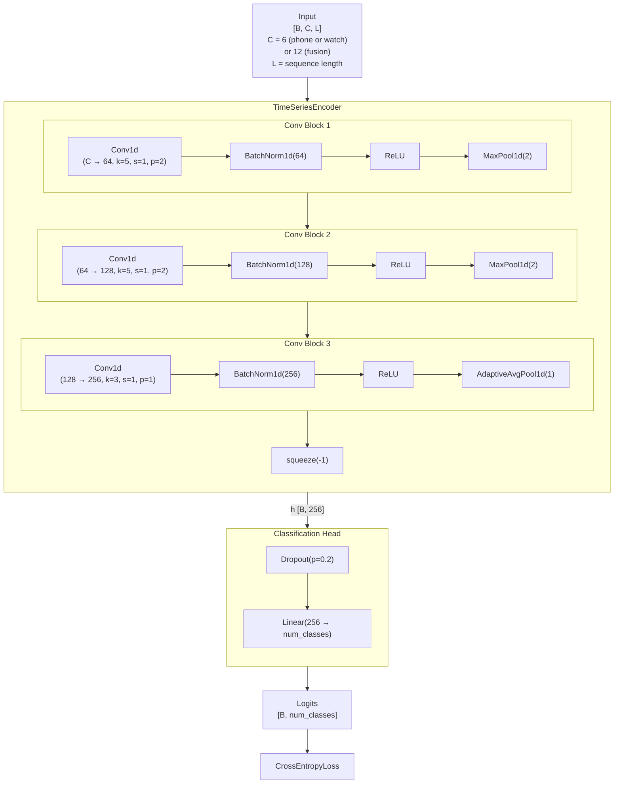

# Baseline CNN Architecture (SupervisedHARModel)

The supervised baseline is a 3-block 1D CNN encoder followed by a linear classification head, trained end-to-end with cross-entropy loss.

## Architecture Diagram

## Tensor Shape Flow

| Stage | Shape | Notes |
|---|---|---|
| Input | `[B, C, L]` | C=6 (single modality), C=12 (fusion) |
| After Block 1 | `[B, 64, L/2]` | MaxPool halves temporal dim |
| After Block 2 | `[B, 128, L/4]` | MaxPool halves again |
| After Block 3 | `[B, 256, 1]` | AdaptiveAvgPool collapses to 1 step |
| Encoder output `h` | `[B, 256]` | squeeze(-1) removes last dim |
| Logits | `[B, num_classes]` | Linear projection |

## Training Details

| Hyperparameter | Value |
|---|---|
| Optimizer | AdamW |
| Learning rate | 1e-3 |
| Weight decay | 1e-4 |
| Dropout | 0.2 |
| Loss | CrossEntropyLoss |
| Early stopping metric | macro F1 |
| Gradient clipping | 1.0 |
| Batch size | 256 |
