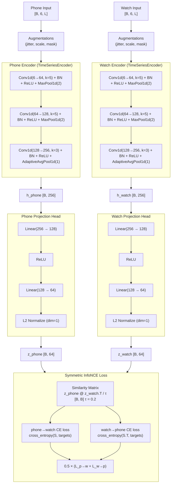
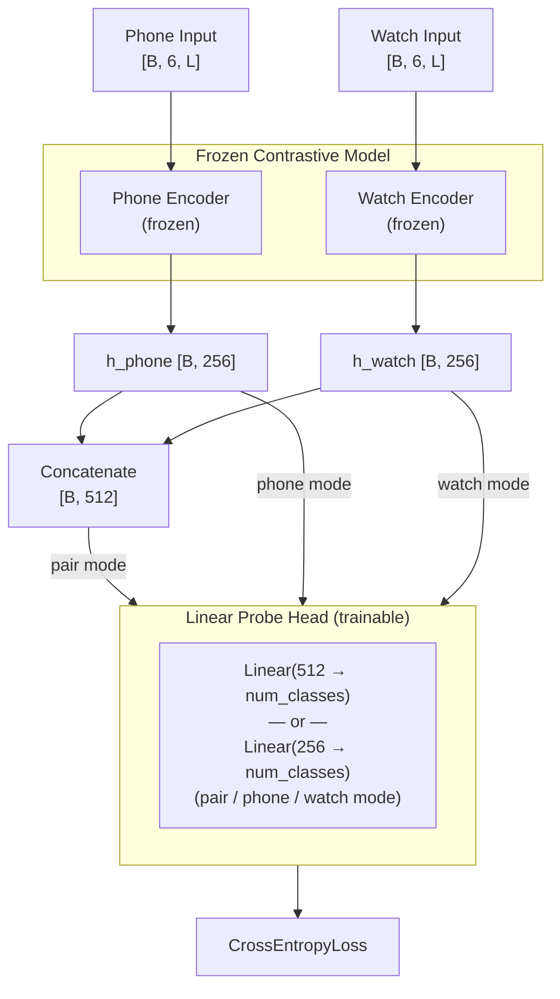

# Contrastive Learning Model Architecture (PhoneWatchContrastiveModel)

The contrastive model uses two separate encoders (one per modality) trained with a symmetric InfoNCE loss to align phone and watch representations of the same activity window. The encoder backbone is identical in architecture to the supervised baseline but trained with a different objective.

## Full Training Architecture

## Linear Probe Evaluation (Downstream Task)

After contrastive pretraining, encoder weights are **frozen** and a single linear layer is trained on the representations.

## Tensor Shape Flow

| Stage | Shape | Notes |
|---|---|---|
| Phone / watch input | `[B, 6, L]` | 6-channel IMU (accel + gyro) |
| After encoder | `[B, 256]` | `h_phone`, `h_watch` — used for probe |
| After projection | `[B, 64]` | `z_phone`, `z_watch` — L2-normalized |
| Similarity matrix | `[B, B]` | All pairwise cosine sims / τ |
| Probe input (pair) | `[B, 512]` | h_phone ‖ h_watch concatenated |
| Probe input (single) | `[B, 256]` | h_phone or h_watch only |
| Logits | `[B, num_classes]` | Linear probe output |

## Data Augmentations (Contrastive Training Only)

| Augmentation | Config |
|---|---|
| Gaussian jitter | σ = 0.01 |
| Random scaling | uniform(0.9, 1.1) per batch |
| Random masking | 10% of steps masked in segments of length 6 |

## Training Details

| Hyperparameter | Contrastive | Linear Probe |
|---|---|---|
| Optimizer | AdamW | AdamW |
| Learning rate | 3e-4 | 1e-3 |
| Weight decay | 1e-4 | 1e-4 |
| Loss | Symmetric InfoNCE | CrossEntropyLoss |
| Temperature (τ) | 0.2 | — |
| Early stopping metric | val_loss | macro F1 |
| Gradient clipping | 1.0 | 1.0 |
| Batch size | 256 | 256 |
| Encoder weights | Trained | Frozen |
