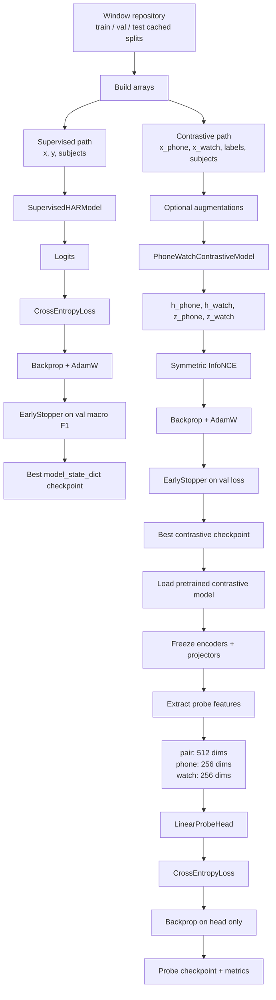

# Current Model Architecture and State

This document describes the model architecture that is actually present in the repository today, based on the code in `src/models`, `src/train_supervised.py`, `src/train_contrastive.py`, and `src/train_probe.py`.

One important caveat: the training scripts import `src.data`, but that package is not checked into this repository snapshot. Because of that, the input sample objects and window repository details below are inferred from how they are consumed by the model and training code.

## 1. High-level architecture

```mermaid
flowchart LR
    subgraph Inputs["Windowed sensor inputs"]
        PF["Fusion window\nx_fusion: [B, 12, L]"]
        PP["Phone window\nx_phone: [B, 6, L]"]
        PW["Watch window\nx_watch: [B, 6, L]"]
    end

    subgraph Encoder["TimeSeriesEncoder"]
        E1["Conv1d(C->64, k=5, pad=2)"]
        E2["BatchNorm1d(64)"]
        E3["ReLU"]
        E4["MaxPool1d(2)"]
        E5["Conv1d(64->128, k=5, pad=2)"]
        E6["BatchNorm1d(128)"]
        E7["ReLU"]
        E8["MaxPool1d(2)"]
        E9["Conv1d(128->256, k=3, pad=1)"]
        E10["BatchNorm1d(256)"]
        E11["ReLU"]
        E12["AdaptiveAvgPool1d(1)"]
        E13["Squeeze time dim\nh: [B, 256]"]
    end

    subgraph Supervised["Supervised path"]
        S1["Dropout(p=0.2 default)"]
        S2["Linear(256 -> num_classes)"]
        S3["Logits: [B, K]"]
        S4["CrossEntropyLoss"]
    end

    subgraph Contrastive["Contrastive path"]
        C1["Phone encoder\nseparate params"]
        C2["Watch encoder\nseparate params"]
        C3["Projection head\nLinear 256->128"]
        C4["ReLU"]
        C5["Linear 128->64"]
        C6["L2 normalize\nz: [B, 64]"]
        C7["Symmetric InfoNCE"]
        C8["Similarity matrix\n[B, B]"]
    end

    PF --> E1
    E1 --> E2 --> E3 --> E4 --> E5 --> E6 --> E7 --> E8 --> E9 --> E10 --> E11 --> E12 --> E13
    E13 --> S1 --> S2 --> S3 --> S4

    PP --> C1
    PW --> C2
    C1 --> C3 --> C4 --> C5 --> C6
    C2 --> C3w["Projection head\nLinear 256->128"] --> C4w["ReLU"] --> C5w["Linear 128->64"] --> C6w["L2 normalize\nz: [B, 64]"]
    C6 --> C8
    C6w --> C8
    C8 --> C7
```

## 2. Exact encoder shape flow

For an input tensor shaped `[batch, channels, sequence_length]`:

1. `Conv1d(in_channels, 64, kernel_size=5, stride=1, padding=2)`
   Output: `[B, 64, L]`
2. `BatchNorm1d(64)`
   Output: `[B, 64, L]`
3. `ReLU`
   Output: `[B, 64, L]`
4. `MaxPool1d(2)`
   Output: `[B, 64, floor(L/2)]`
5. `Conv1d(64, 128, kernel_size=5, stride=1, padding=2)`
   Output: `[B, 128, floor(L/2)]`
6. `BatchNorm1d(128)`
   Output: `[B, 128, floor(L/2)]`
7. `ReLU`
   Output: `[B, 128, floor(L/2)]`
8. `MaxPool1d(2)`
   Output: `[B, 128, floor(L/4)]`
9. `Conv1d(128, 256, kernel_size=3, stride=1, padding=1)`
   Output: `[B, 256, floor(L/4)]`
10. `BatchNorm1d(256)`
    Output: `[B, 256, floor(L/4)]`
11. `ReLU`
    Output: `[B, 256, floor(L/4)]`
12. `AdaptiveAvgPool1d(1)`
    Output: `[B, 256, 1]`
13. `squeeze(-1)`
    Output: `[B, 256]`

This final 256-dimensional vector is the shared latent representation used everywhere else in the project.

## 3. What the repository means by "the current model"

There are really three connected models in the codebase:

### A. SupervisedHARModel

Used in `src/train_supervised.py`.

- Input:
  - `fusion`: `[B, 12, L]`
  - `phone`: `[B, 6, L]`
  - `watch`: `[B, 6, L]`
- Backbone:
  - One `TimeSeriesEncoder`
- Head:
  - `Dropout`
  - `Linear(256 -> num_classes)`
- Output:
  - Activity logits `[B, K]`

This is the simplest end-to-end classifier in the repo.

### B. PhoneWatchContrastiveModel

Used in `src/train_contrastive.py`.

- Input:
  - `x_phone: [B, 6, L]`
  - `x_watch: [B, 6, L]`
- Backbone:
  - One phone encoder
  - One watch encoder
  - Same architecture, different learned weights
- Heads:
  - One phone projection head
  - One watch projection head
- Output:
  - `h_phone: [B, 256]`
  - `h_watch: [B, 256]`
  - `z_phone: [B, 64]`
  - `z_watch: [B, 64]`

The model returns these values in the `ContrastiveForwardOutput` dataclass.

### C. Linear probe

Used in `src/train_probe.py`.

- Frozen source:
  - A pretrained `PhoneWatchContrastiveModel`
- Feature construction:
  - `pair`: `[h_phone | h_watch]` giving `[B, 512]`
  - `phone`: `h_phone` giving `[B, 256]`
  - `watch`: `h_watch` giving `[B, 256]`
- Head:
  - `LinearProbeHead`, a single linear layer

This stage does not update the encoders. It only trains the linear classifier on top of frozen embeddings.

## 4. State inside the model

There are several different kinds of "state" in this project.

### A. Forward-pass state

This is the temporary state created while a batch moves through the network.

For supervised training:

- `x_batch`
- encoder activations
- final embedding `h`
- class logits
- cross-entropy loss
- predicted labels via `argmax`

For contrastive training:

- `x_phone`, `x_watch`
- optionally augmented versions:
  - `x_phone_aug`
  - `x_watch_aug`
- latent vectors:
  - `h_phone`
  - `h_watch`
- projected contrastive vectors:
  - `z_phone`
  - `z_watch`
- similarity matrix:
  - `z_phone @ z_watch.T / temperature`
- targets:
  - `torch.arange(batch_size)`
- losses:
  - phone-to-watch loss
  - watch-to-phone loss
  - symmetric average loss

This forward state exists only for the current batch and is discarded after backprop finishes.

### B. Learned parameter state

This is the persistent state of the neural network itself.

For the encoder:

- convolution weights and biases
- batch norm parameters
- batch norm running mean and running variance

For the supervised model:

- all encoder parameters
- classifier linear layer parameters

For the contrastive model:

- phone encoder parameters
- watch encoder parameters
- phone projector parameters
- watch projector parameters

This is what `state_dict()` captures.

### C. Training-control state

This is the state that controls optimization rather than representation.

The important one in this repo is `EarlyStopper`, which stores:

- `best_score`
- `best_epoch`
- `epochs_without_improvement`
- `should_stop`
- `history`

The training scripts also maintain:

- `history` for per-epoch metrics
- `best_state` as a copy of the best `state_dict`
- optimizer state inside `AdamW`
- the chosen runtime device

### D. Checkpoint state

This is the serialized state saved to disk.

Supervised checkpoints save:

- `model_state_dict`
- `label_to_index`
- `channel_mode`
- `label_fraction`
- `best_epoch`
- metadata with config and manifest path

Contrastive checkpoints save:

- `model_state_dict`
- `phone_encoder_state_dict`
- `watch_encoder_state_dict`
- `phone_projector_state_dict`
- `watch_projector_state_dict`
- `label_to_index`
- `best_epoch`
- metadata with config and manifest path

Probe checkpoints save:

- `linear_head_state_dict`
- `probe_mode`
- `label_fraction`
- `best_epoch`
- `encoder_checkpoint_path`
- `label_to_index`
- metadata with config and manifest path

## 5. State transitions across the training pipeline

## 6. How to read the contrastive model state

The contrastive model intentionally separates two representational levels:

### Encoder state: `h_phone`, `h_watch`

- These are 256-dimensional features.
- They are the reusable semantic embeddings.
- Probe evaluation uses these vectors, not the 64-dimensional projection outputs.
- In other words, this is the state the project treats as the useful representation.

### Projection state: `z_phone`, `z_watch`

- These are 64-dimensional normalized vectors.
- They exist specifically to make the InfoNCE objective work well.
- They are training-facing state, not the preferred downstream representation.
- This follows the common contrastive-learning pattern where the projector is used during pretraining and the encoder features are used afterward.

## 7. Practical interpretation

If you want the shortest accurate summary of the current system, it is this:

- The core building block is a 3-layer 1D CNN encoder that compresses a multichannel inertial window into a 256-dimensional embedding.
- The supervised baseline adds a dropout-plus-linear classifier directly on top of that embedding.
- The contrastive model duplicates the encoder into phone and watch branches, then adds separate 2-layer projection heads that map each branch into a normalized 64-dimensional space for symmetric InfoNCE training.
- The probe stage freezes the contrastive encoders, extracts 256-dimensional or 512-dimensional features, and trains only a linear classifier.

## 8. Repository-grounded caveats

- The architecture description above is fully grounded in the checked-in model and training code.
- The exact cached sample dataclasses and window-loading logic are partially inferred because `src.data` is imported but not present in this repository snapshot.
- From usage, each sample appears to expose:
  - `x_fusion`
  - `x_phone`
  - `x_watch`
  - `label_idx`
  - `subject_id`
